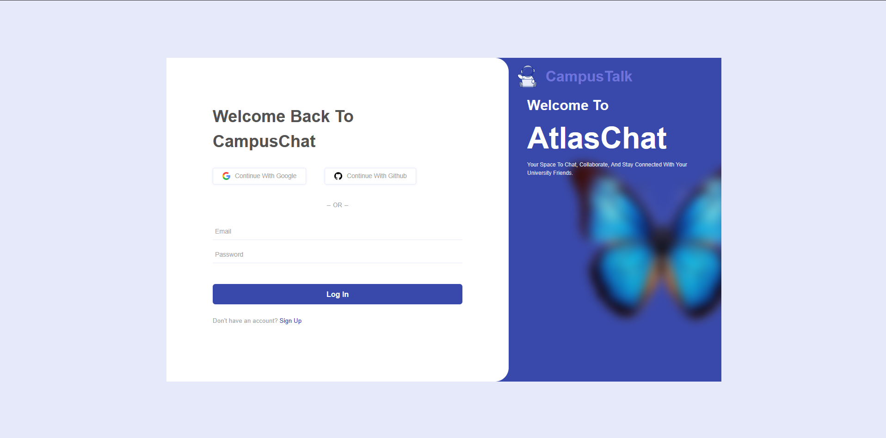
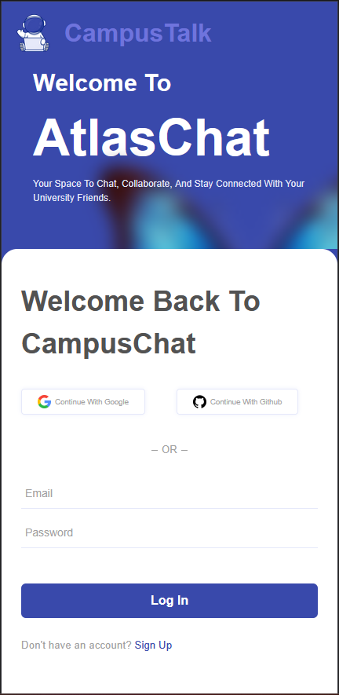
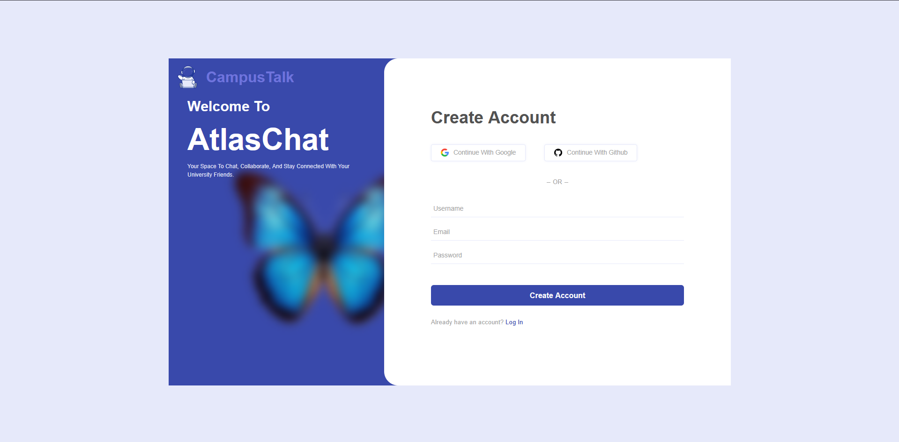
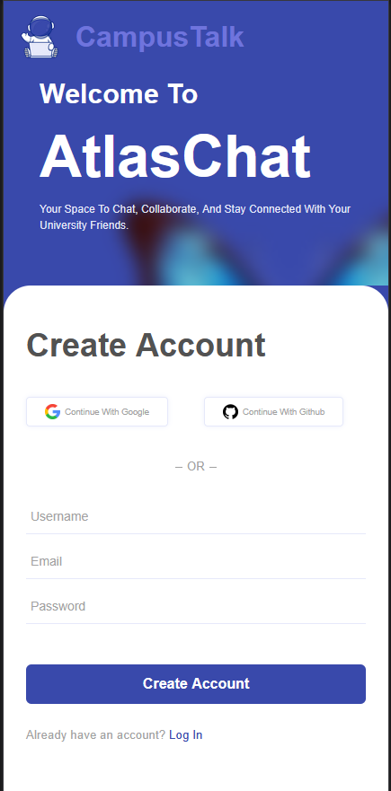

# AtlasChat – Campus Communication Platform

AtlasChat is a modern, responsive web application built to connect university students in real-time. Designed with a user-friendly interface and clean aesthetic, it offers sign-up, login, and protected chat access as part of an ongoing journey to explore full-stack web development.

> Created by a frontend developer expanding into backend development for the first time.
> [app link](https://moulahguine.github.io/AtlasTalk/public/signup.html)
---

## Screenshots

### Login Page

### Signup Page

---

## Demo Video

Watch the full project in action:  
[Watch AtlasChat Demo](https://your-video-link-here.com)

---

## Features

-  Clean, modern UI built from scratch with semantic HTML and **Sass**
-  Fully responsive design across devices
-  User Authentication (Sign Up & Log In)
-  Session-based login persistence (via Express sessions)
-  Stylish form elements and interactive feedback

---

## Technologies Used

### Frontend

- HTML5 / Sass (SCSS)
- Vanilla JavaScript
- Responsive design with media queries
- Modular SCSS files for maintainable styles
- Pages:
  - `login.html`
  - `signup.html`
  - `chat.html`

### Backend (Learning in Progress)

- Node.js + Express.js
- MongoDB with Mongoose
- bcryptjs for password hashing
- express-session for authentication
- Deployed with [Render](https://render.com)
- MongoDB hosted on [MongoDB Atlas](https://www.mongodb.com/cloud/atlas)

---

##  Deployment

- Frontend served as static files (locally or via GitHub Pages)
- Backend deployed on Render with environment variables:
  - `PORT`
  - `MONGO_URI` (MongoDB Atlas connection string)

---

##  Acknowledgments

> This project began as a frontend developer's experiment to understand backend fundamentals and full-stack workflows. Huge thanks to the open source community for guidance and tools

---

##  Contact

- **Creator:** Mohamed Oulahguine
- **linkedin:** [@myLinkedIn](https://www.linkedin.com/in/moulahguine/)
- **Email:** mohamedoulahguine@gmail.com

---
